# An Address to the Epicurean Paradox

_Written for the BibleAnalysis project._

## The Paradox

The Epicurean paradox is usually stated like this:

If God is willing to prevent evil but unable, then He is not all-powerful.

If God is able to prevent evil but unwilling, then He is not good.

If God is both willing and able to prevent evil, then why does evil exist?

This question deserves more than slogans. The world contains real suffering: betrayal, abuse, disease, war, starvation, grief, death, loneliness, injustice, terror, and unanswered cries. Any answer that makes evil feel imaginary, necessary in a simplistic way, or emotionally trivial is unworthy of the God revealed in Jesus Christ.

The question deserves reverence because the suffering creature deserves reverence.

But the paradox also contains hidden assumptions. It assumes that if God is good and powerful, then God must prevent every evil immediately, in every case, by direct intervention, and that any failure to do so proves either inability or unwillingness.

That assumption needs an argument before it can carry the paradox.

It imagines goodness mainly as prevention.

The Christian answer begins somewhere else: with creation, freedom, divine patience, the cross, resurrection, judgment, and new creation.

## Scope

This address leaves every particular tragedy to reverent mystery. It refuses to call evil good, to hand a grieving person an argument and expect the wound to close, or to treat atheists as foolish for feeling the force of the objection. Christians are still called to grieve, protest injustice, and ask God hard questions.

The claim is narrower, and I think stronger for being narrow:

- The Epicurean paradox is emotionally powerful because evil is real.
- The paradox depends logically on several hidden assumptions.
- The evidential weight of evil remains serious, but Christianity offers a coherent account of freedom, fallenness, divine restraint, redemption, judgment, and final restoration.
- The existential wound of evil requires more than logic.
- The Christian answer ultimately stands or falls with the person of Jesus Christ: incarnation, cross, resurrection, Spirit, judgment, and new creation.

## A Better Framing

The usual framing asks:

"Why does a good and powerful God permit evil?"

The deeper question is:

"What kind of reality did God choose to create, and what kind of goodness is God committed to bringing forth within it?"

If God created a world without creaturely freedom, then no creature could truly love. A reality with no freedom might have no rebellion, but it would also have no uncoerced love, no real trust, no actual moral weight, no genuine relationship, and no meaningful consent.

A command can require behavior. Love has to be born in liberty.

Freedom gives no neat one-to-one explanation for every instance of suffering. Some suffering comes from direct human evil, some from negligence, some from systems built by generations of sin, some from the brokenness of creation itself. Some remains mysterious.

But freedom helps explain the kind of world God provisioned: a world where real creatures can make real decisions, where those decisions have real gravity, and where love can be freely given instead of mechanically produced.

Such a world expresses God's sovereignty.

God is sovereign enough to provision a free-will zone.

## A Personal Decision Flow For An Honest Skeptic

The following flowchart approaches the question from the perspective of an atheist, agnostic, or honest skeptic wrestling with the question, "Is there a God?" It invites honest engagement without fake belief or minimized suffering. It begins where many people actually begin: evil is real, pain is real, and the existence of suffering feels like evidence against God.

The chart offers a path for examining whether the Epicurean paradox actually disproves God, or whether the Christian answer in Jesus Christ remains coherent, morally serious, and personally worth seeking.

```mermaid
flowchart TB
    subgraph S1["1. Start Honestly"]
        A["<b>I encounter real evil</b><br/>or suffering"]
        B["<b>I refuse shallow answers</b><br/>Pain is real; minimizing evil<br/>would be dishonest"]
        C{"Is there<br/>immediate danger?"}
        D["<b>I seek protection</b><br/>help, justice, and practical care"]
        E["<b>Then I ask the larger question</b><br/>Does evil make God impossible?"]
        A --> B --> C
        C -->|Yes| D --> E
        C -->|No| E
    end

    subgraph S2["2. Name The Objection"]
        F["<b>Epicurean objection</b><br/>If God is good and powerful,<br/>why is evil still here?"]
        G{"What kind of objection<br/>is this for me?"}
        H["<b>Logical objection</b><br/>God and evil cannot both exist"]
        I["<b>Evidential objection</b><br/>This much suffering makes God<br/>seem unlikely"]
        J["<b>Existential wound</b><br/>I am angry, grieving,<br/>or unable to trust"]
        K["<b>Mixed objection</b><br/>More than one level is active"]
        F --> G
        G --> H
        G --> I
        G --> J
        G --> K
    end

    subgraph S3["3. Test The Logical Claim"]
        L{"What must be true<br/>for evil to logically disprove God?"}
        M["<b>Assumption 1</b><br/>Goodness must mean immediate<br/>prevention of every evil"]
        M1["<b>Implication</b><br/>Patience, repentance, freedom,<br/>and redemptive history become<br/>morally suspect"]
        N["<b>Assumption 2</b><br/>Power must mean coercive control<br/>over every creaturely choice"]
        N1["<b>Implication</b><br/>Power becomes domination;<br/>override replaces invitation"]
        O["<b>Assumption 3</b><br/>Real love could exist<br/>without real freedom or refusal"]
        O1["<b>Implication</b><br/>Love, trust, consent,<br/>and moral responsibility lose<br/>their real weight"]
        P{"Are these assumptions<br/>unavoidable?"}
        Q["<b>If yes</b><br/>The paradox remains a serious objection;<br/>belief needs more light"]
        R["<b>If no</b><br/>The paradox loses logical force;<br/>I can consider a wider frame"]
        S["<b>Moral pressure point</b><br/>If I remain an atheist, how do I account<br/>for the weight of<br/>'this should not be'?"]
        L --> M --> M1 --> P
        L --> N --> N1 --> P
        L --> O --> O1 --> P
        P -->|Yes| Q
        P -->|No| R --> S
    end

    subgraph S4["4. Consider The Christian Frame"]
        T["<b>Freedom frame</b><br/>Real love requires real freedom;<br/>real freedom allows real refusal<br/>and real consequences"]
        U{"Could divine restraint express<br/>patience, love, and respect for freedom?"}
        V["<b>Honest objection</b><br/>But why this much pain,<br/>and why these wounds?"]
        W["<b>Christian humility</b><br/>The answer leaves room<br/>for mystery and lament"]
        X["<b>Christian claim</b><br/>God answers evil most fully<br/>by acting in Jesus Christ"]
        T --> U
        U -->|No| V --> W --> X
        U -->|Yes| X
    end

    subgraph S5["5. Examine Jesus"]
        Y["<b>Incarnation</b><br/>God enters suffering"]
        Z["<b>Cross</b><br/>God bears evil, judges sin,<br/>and offers mercy"]
        AA["<b>Resurrection</b><br/>God conquers death"]
        AB{"Does Jesus make trust in God<br/>morally and existentially possible?"}
        AC["<b>Not yet</b><br/>Keep asking, lamenting,<br/>and looking honestly"]
        AD["<b>Yes or maybe</b><br/>Move from the abstract question about God<br/>toward the person of Jesus"]
        Y --> Z --> AA --> AB
        AB -->|Not yet| AC
        AB -->|Yes or maybe| AD
    end

    subgraph S6["6. Choose The Next Honest Step"]
        AE{"What response is honest now?"}
        AF["<b>Reject</b><br/>This still seems incoherent"]
        AG["<b>Suspend judgment</b><br/>I need more light"]
        AH["<b>Seek</b><br/>Jesus, if You are real,<br/>show me who You are"]
        AI["<b>Trust</b><br/>God is good, powerful,<br/>and redemptive in Christ"]
        AJ["<b>Walk accordingly</b><br/>Resist evil, protect the vulnerable,<br/>seek truth, and practice mercy"]
        AK["<b>Hope</b><br/>Final judgment and new creation<br/>answer evil without denying it"]
        AE --> AF
        AE --> AG
        AE --> AH
        AE --> AI --> AJ --> AK
    end

    E --> F
    H --> L
    I --> V
    J --> AC
    K --> L
    K --> V
    K --> AC
    Q -.-> AE
    S --> T
    X --> Y
    AC -.-> AE
    AD --> AE

    classDef question fill:#f6f8fa,stroke:#57606a,stroke-width:1px,color:#24292f;
    classDef care fill:#fff8c5,stroke:#9a6700,stroke-width:1px,color:#3b2300;
    classDef grief fill:#ffebe9,stroke:#cf222e,stroke-width:1px,color:#82071e;
    classDef discern fill:#eaf5ff,stroke:#0969da,stroke-width:1px,color:#0a3069;
    classDef implication fill:#fff1e5,stroke:#bc4c00,stroke-width:1px,color:#5c2e00;
    classDef christ fill:#dafbe1,stroke:#1a7f37,stroke-width:1px,color:#116329;
    classDef hope fill:#fbefff,stroke:#8250df,stroke-width:1px,color:#512a97;

    class C,G,L,P,U,AB,AE question;
    class A,B,D,E care;
    class F,I,J,K,Q,V,W,AF,AG grief;
    class H discern;
    class M,N,O,R,S,T discern;
    class M1,N1,O1 implication;
    class X,Y,Z,AA,AC,AD,AH,AI christ;
    class AJ,AK hope;
```

The second stage matters because the "problem of evil" is usually three questions braided together:

- The logical question: Do God and evil contradict each other?
- The evidential question: Does the amount, intensity, and apparent randomness of suffering make God unlikely?
- The existential question: Can I trust, seek, or even want God while I am wounded by evil?

Those questions overlap. Collapsing them creates confusion. The logical question needs careful premise-testing. The evidential question needs a broader account of reality, freedom, history, Jesus, and final restoration. The existential question needs honesty, lament, presence, patience, and often practical care before it needs argument.

A mixed objection may need all three paths at once. That can be a mark of honesty: mind, conscience, and wounded heart all awake at the same time.

The assumption-test section is important because each premise carries a view of reality:

- If goodness must always mean immediate prevention, then divine patience, creaturely freedom, repentance, and long-form redemption become morally suspect before they are examined.
- If power must always mean coercive control, then domination becomes the highest form of power, while love governed by truth, restraint, and mercy gets treated as weakness.
- If real love can exist without real freedom or refusal, then love becomes something closer to programming, instinct, or compliance.
- If those assumptions are unavoidable, the paradox remains a serious objection.
- If those assumptions can be questioned, evil remains grievous without becoming a logical disproof of God.

## Divine Restraint

The paradox often treats God's non-intervention as proof that God either lacks power or lacks concern.

Christian theology has another category: divine restraint.

God can be all-powerful while exercising restraint. He can hold total authority and still refuse domination. He has the power to override creaturely will, yet He chooses restraint because love requires real freedom.

This kind of restraint reveals character.

A tyrant uses power the moment resistance appears. A loving God can be patient without being indifferent. A truthful God can allow creaturely choices to reveal what they really are. A merciful God can give time for repentance. A just God can delay final judgment without abandoning justice.

If God immediately destroyed every evil impulse, every false desire, every self-deceptive motive, every act of pride, and every movement of rebellion, safety would give way to finality.

The story would end.

Divine patience should never be mistaken for approval of evil.

It reveals God's willingness to work redemptively in time, even with free creatures who have already turned toward disorder.

## The Cross Changes the Question

Christianity plants its answer to the problem of evil at the cross.

At the cross, God enters the suffering that philosophy can only discuss.

In Jesus Christ, God comes into the world He made. He takes on flesh. He experiences hunger, exhaustion, rejection, betrayal, injustice, torture, humiliation, and death. He is murdered by human religion, human politics, human fear, human power, human law, and human self-preservation.

The cross reveals a pattern that a tidy argument never could. Evil is exposed instead of explained away. Suffering is borne from within. Forgiveness answers evil without becoming evil. Death is conquered by passing through it.

The cross is God's answer to the accusation that He is unwilling to deal with evil.

He was willing to be crucified.

The resurrection is God's answer to the accusation that He is unable to deal with evil.

He conquered death.

Jesus said, "I have overcome the world" (John 16:33).

Jesus says in the same verse that the world has tribulation. The comfort is that tribulation loses the final word.

## The Paradox Assumes Immediate Prevention Is the Highest Good

The paradox has force because prevention often is good.

A good parent prevents a child from touching fire.

A good judge prevents a murderer from harming again.

A good neighbor intervenes when someone is being abused.

Why, then, does God's governance include more than universal prevention?

Prevention matters. Christianity also insists that goodness has more range than prevention: redemption, patience, judgment at the proper time, the honoring of creaturely freedom, the formation of persons who can love and repent, and the final restoration of all things.

If God prevented every possible suffering immediately, the world would never become the kind of reality where free creatures can meaningfully live before Him. If God never prevented, restrained, judged, healed, or restored evil, He would fail to be good. Christianity occupies the ground between those extremes.

Christianity claims that God prevents, permits, restrains, exposes, and redeems in ways hidden from us inside history. It also claims He will judge evil finally and remove it completely.

The paradox overreaches when it treats God's refusal to prevent all evil immediately as proof of powerlessness or immorality.

## Evil Will End

Christianity treats evil as abnormal, temporary, and alien to God's nature.

Evil is parasitic. It corrupts what is good, twisting, distorting, fracturing, and destroying what God made. Its power is derivative.

This matters because the protest against evil depends on goodness being real.

When someone says, "This should not be," they are appealing to a moral reality beyond mere preference.

They are saying reality ought to be otherwise.

Christianity agrees.

Death, abuse, betrayal, war, and injustice should not be.

The Christian faith allows the sufferer to call evil evil, then points to the crucified and risen Christ as the pledge that evil will not reign forever.

Revelation promises a day when death, mourning, crying, and pain are no more (Revelation 21:4).

That is eschatological judgment and restoration. Sentimental optimism is too thin for what Scripture promises.

## The Role of Human Freedom

A world with real freedom must allow real refusal.

If a person can choose love, truth, mercy, and God, then that same person can choose self-rule, deception, cruelty, and rejection.

This is terrifying, but it is also the condition under which love is meaningful.

The fall in Eden can be understood as humanity choosing to define good and evil apart from direct, personal relationship with God. The issue runs deeper than rule-breaking. The creature attempts to become its own moral origin.

From that root comes death. Separation from the source of life produces death.

God responds with promise, patience, covenant, incarnation, cross, resurrection, Spirit, church, and final restoration. An unwilling God would abandon His creation; the biblical God refuses.

## Natural Evil and the Groaning of Creation

Some of the hardest forms of suffering resist any clean trace back to a particular human choice.

Earthquakes. Cancer. Childhood disease. Natural disaster. Genetic disorder. The death of the innocent.

These should make any thoughtful person speak carefully.

Christianity forbids explaining every wound as if we have access to God's private reasoning. Job's friends tried that, and they were wrong.

Scripture gives a broader picture: creation itself is disordered, groaning, awaiting liberation. Human sin reaches beyond private action; its consequences are cosmic. Death has entered the human story, and creation is caught in bondage to decay.

Even here, Christianity points to redemptive history. God is bringing about new creation; isolated repair would be too small for the biblical promise.

## The Cross Prevents Two False Answers

The cross answers the suspicion that God lacks care.

The resurrection answers the fear that God lacks power to win.

These two truths must be held together.

Care without conquest collapses into hopeless compassion. Conquest without care becomes raw power.

In Jesus Christ, God shows both: He weeps, bleeds, forgives, rises, reigns, judges, and restores.

A Person stands at the center of the answer to evil.

## Why God Respects Free Will

Forced goodness would amount to domination. If God overrode every soul at the point of refusal, He would produce compliance without communion.

God wants more than behavior that conforms to goodness. He wants real relationship: love, trust, worship, communion, and shared life.

Coercion cannot produce those realities.

A command can reveal a standard, expose rebellion, and protect life. What it cannot do is manufacture love.

Love must be free.

Therefore a world where love can exist is also a world where love can be refused.

God's restraint honors the reality of the creature. It also reveals the truth about what creaturely self-rule produces. Humanity's attempt to build life apart from God yields death instead of peace, innocence, or justice. At the center of history, humanity murders the most innocent Man who ever lived.

The cross exposes the final logic of self-rule.

The resurrection reveals the final power of God.

## The Best Possible Resolution

The Christian claim reaches far beyond a vague hope that things will "turn out okay." God will resolve evil in the best possible way because of who He is. His justice brings deception into the light. His mercy is deeper than human sin. His love is stronger than death. His wisdom accounts for dimensions of reality no human mind can see. His power takes the form of resurrection. Tyranny belongs to a different kingdom. His judgment aligns all things with truth; arbitrary punishment has no place in it. His final restoration will answer suffering without denying it.

Romans 8:28 says God works all things together for good for those who love Him. It never calls all things good.

That distinction matters.

Evil remains evil.

God remains good.

And God is able to work even evil into a final goodness that evil itself did not intend and cannot prevent.

## Direct Answers To The Three Objections

The logical objection asks: "Do God and evil contradict each other?"

Only under certain assumptions. The contradiction requires goodness to mean immediate prevention of every evil, power to mean coercive control over every creaturely choice, and love to remain meaningful without real freedom or refusal. Question those assumptions, and evil remains terrible without becoming a logical disproof of God.

The evidential objection asks: "Even if God and evil are not logically contradictory, does this much suffering make God unlikely?"

This objection should be taken seriously. The amount, intensity, and apparent randomness of suffering are heavy matters. Christianity refuses to call suffering light or obvious. It offers a larger account of reality: creation is good but fallen, freedom is real but dangerous, evil is parasitic but devastating, God is patient but active, the cross is God's entrance into suffering, the resurrection is God's victory over death, and final judgment/new creation are God's promise that evil will be answered.

The existential objection asks: "Can I trust, seek, or even want God while I am wounded by evil?"

Sometimes the honest answer is, "Not yet." That answer deserves respect. A wounded person may need safety, lament, time, wise presence, and practical care before they can engage an argument. Christianity's deepest answer here is Jesus Himself: God with wounds, God near the grieving, God crucified, God risen, God able to receive anger and grief without being threatened by them.

So is God willing to prevent evil?

Yes, and His will reaches beyond immediate prevention into redemption, repentance, freedom, judgment, restoration, and eternal life.

Is God able to prevent evil?

Yes, and His power remains governed by His character. He uses power in harmony with love, truth, freedom, mercy, and the reality of relationship.

Then why does evil exist?

Because God created a reality where love and freedom are real, where creaturely choices carry genuine weight, where the world has fallen into corruption, and where God has chosen to redeem and restore creation through Jesus Christ while honoring the freedom He gave.

Will evil remain forever?

No.

The cross has judged sin.

The resurrection has conquered death.

The Spirit is already applying Christ's life to believers.

The final judgment will bring all things into the full light of truth.

The new creation will remove death, mourning, crying, and pain.

## The Pastoral Word

Do not throw this address at a grieving person.

There are moments when the faithful answer is silence, tears, presence, prayer, food, protection, practical help, and waiting with someone in pain.

The problem of evil is an intellectual problem and a wound.

Arguments alone do not heal wounds.

But when the soul is ready to ask whether suffering disproves God, Christianity points to Jesus: to the cross, to the empty tomb, and to the God present in suffering, victorious over evil, attentive to injustice, and still at work in creation. The invitation is personal: trust Him.

## Final Summary

The Epicurean paradox is powerful because evil is real.

As a logical argument, it depends on hidden assumptions about goodness, power, love, and freedom.

As an evidential argument, it remains serious because the amount and intensity of suffering are serious.

As an existential wound, it must be approached with reverence because pain is concrete.

The Christian answer is that God is good, God is powerful, and God is also patient, truthful, merciful, self-restrained, freedom-honoring, and redemptive.

God's goodness is revealed through His willingness to enter a world with freedom, bear its evil, defeat death, and bring creation to final restoration in Jesus Christ.

Christianity never shrinks suffering.

It magnifies Jesus Christ.
