# An Address to the Epicurean Paradox

_Written for the BibleAnalysis project._

## The Paradox

The Epicurean paradox is usually stated like this:

If God is willing to prevent evil but unable, then He is not all-powerful.

If God is able to prevent evil but unwilling, then He is not good.

If God is both willing and able to prevent evil, then why does evil exist?

This is not a shallow question. It should not be answered with slogans. The world contains real suffering: betrayal, abuse, disease, war, starvation, grief, death, loneliness, injustice, terror, and unanswered cries. Any answer that makes evil feel imaginary, necessary in a simplistic way, or emotionally trivial is not worthy of the God revealed in Jesus Christ.

The question deserves reverence because the suffering creature deserves reverence.

But the paradox also contains hidden assumptions. It assumes that if God is good and powerful, then God must prevent every evil immediately, in every case, by direct intervention, and that any failure to do so proves either inability or unwillingness.

That assumption is not self-evident.

It imagines goodness mainly as prevention.

The Christian answer begins somewhere else: with creation, freedom, divine patience, the cross, resurrection, judgment, and new creation.

## A Better Framing

The question is not simply:

"Why does a good and powerful God permit evil?"

The deeper question is:

"What kind of reality did God choose to create, and what kind of goodness is God committed to bringing forth within it?"

If God created a world without creaturely freedom, then no creature could truly love. A reality with no freedom might have no rebellion, but it would also have no uncoerced love, no real trust, no actual moral weight, no genuine relationship, and no meaningful consent.

Love cannot be manufactured by command.

Love must be born in liberty.

This does not mean freedom explains every instance of suffering in a simple one-to-one way. It does not. Some suffering comes from direct human evil. Some comes from negligence. Some comes from systems built by generations of sin. Some comes from the brokenness of creation itself. Some suffering remains mysterious.

But freedom helps explain the kind of world God provisioned: a world where real creatures can make real decisions, where those decisions have real gravity, and where love can be freely given rather than mechanically produced.

God's creation of such a world is not a denial of sovereignty.

It is an expression of sovereignty.

God is sovereign enough to provision a free-will zone.

## A Personal Decision Flow For An Honest Skeptic

The following flowchart approaches the question from the perspective of an atheist, agnostic, or honest skeptic wrestling with the question, "Is there a God?" It does not ask the reader to fake belief or minimize suffering. It begins where many people actually begin: evil is real, pain is real, and the existence of suffering feels like evidence against God.

The chart is not meant to prove everything by itself. It is a path for examining whether the Epicurean paradox actually disproves God, or whether the Christian answer in Jesus Christ remains coherent, morally serious, and personally worth seeking.

```mermaid
flowchart TB
    subgraph S1["1. Start Honestly"]
        A["I encounter real evil<br/>or suffering"]
        B["I refuse shallow answers<br/>Pain is real; evil should not<br/>be minimized"]
        C{"Immediate danger?"}
        D["Seek protection, help,<br/>justice, and practical care"]
        E["Then ask the larger question<br/>Does evil make God impossible?"]
        A --> B --> C
        C -->|Yes| D --> E
        C -->|No| E
    end

    subgraph S2["2. Name The Objection"]
        F["Epicurean objection<br/>If God is good and powerful,<br/>why does He not stop evil?"]
        G{"What kind of objection<br/>is this for me?"}
        H["Logical objection<br/>God and evil cannot both exist"]
        I["Evidential objection<br/>This much suffering makes God<br/>seem unlikely"]
        J["Existential wound<br/>I am angry, grieving,<br/>or unable to trust"]
        K["Mixed objection<br/>More than one level is active"]
        F --> G
        G --> H
        G --> I
        G --> J
        G --> K
    end

    subgraph S3["3. Test The Logical Claim"]
        L{"What must be true<br/>for evil to logically disprove God?"}
        M["Assumption 1<br/>Goodness must mean preventing<br/>every evil immediately"]
        M1["Implication<br/>Goodness leaves little room for<br/>patience, repentance, freedom,<br/>or redemptive history"]
        N["Assumption 2<br/>Power must mean coercive control<br/>over every creaturely choice"]
        N1["Implication<br/>Power becomes domination;<br/>love is protected by override<br/>rather than invitation"]
        O["Assumption 3<br/>A world with real love could exist<br/>without real freedom or refusal"]
        O1["Implication<br/>Love, trust, consent,<br/>and moral responsibility lose<br/>their real weight"]
        P{"Are these assumptions<br/>unavoidable?"}
        Q["If yes<br/>The paradox remains a serious objection;<br/>do not force belief"]
        R["If no<br/>The paradox is not decisive;<br/>consider a wider frame"]
        S["Moral pressure point<br/>If I remain atheist, how do I account<br/>for the weight of<br/>'this should not be'?"]
        L --> M --> M1 --> P
        L --> N --> N1 --> P
        L --> O --> O1 --> P
        P -->|Yes| Q
        P -->|No| R --> S
    end

    subgraph S4["4. Consider The Christian Frame"]
        T["Freedom frame<br/>Real love requires real freedom;<br/>real freedom allows real refusal<br/>and real consequences"]
        U{"Could divine restraint be<br/>patience, love, and respect for freedom,<br/>not weakness or indifference?"}
        V["Honest objection<br/>But why this much pain,<br/>and why these wounds?"]
        W["Christian humility<br/>The answer does not pretend<br/>to know every reason"]
        X["Christian claim<br/>God answers evil most fully<br/>by acting in Jesus Christ"]
        T --> U
        U -->|No| V --> W --> X
        U -->|Yes| X
    end

    subgraph S5["5. Examine Jesus"]
        Y["Incarnation<br/>God enters suffering"]
        Z["Cross<br/>God bears evil, judges sin,<br/>and offers mercy"]
        AA["Resurrection<br/>God conquers death"]
        AB{"Does Jesus make trust in God<br/>morally and existentially possible?"}
        AC["Not yet<br/>Keep asking, lamenting,<br/>and looking honestly"]
        AD["Yes, or maybe<br/>Move from abstract God-question<br/>toward the person of Jesus"]
        Y --> Z --> AA --> AB
        AB -->|Not yet| AC
        AB -->|Yes or maybe| AD
    end

    subgraph S6["6. Choose The Next Honest Step"]
        AE{"What response is honest now?"}
        AF["Reject<br/>I do not find this coherent"]
        AG["Suspend judgment<br/>I need more light"]
        AH["Seek<br/>Jesus, if You are real,<br/>show me who You are"]
        AI["Trust<br/>God is good, powerful,<br/>and redemptive in Christ"]
        AJ["Walk accordingly<br/>Resist evil, protect the vulnerable,<br/>seek truth, and practice mercy"]
        AK["Hope<br/>Final judgment and new creation<br/>answer evil without denying it"]
        AE --> AF
        AE --> AG
        AE --> AH
        AE --> AI --> AJ --> AK
    end

    E --> F
    H --> L
    I --> V
    J --> AC
    K --> L
    K --> V
    K --> AC
    Q -.-> AE
    S --> T
    X --> Y
    AC -.-> AE
    AD --> AE

    classDef question fill:#f6f8fa,stroke:#57606a,stroke-width:1px,color:#24292f;
    classDef care fill:#fff8c5,stroke:#9a6700,stroke-width:1px,color:#3b2300;
    classDef grief fill:#ffebe9,stroke:#cf222e,stroke-width:1px,color:#82071e;
    classDef discern fill:#eaf5ff,stroke:#0969da,stroke-width:1px,color:#0a3069;
    classDef implication fill:#fff1e5,stroke:#bc4c00,stroke-width:1px,color:#5c2e00;
    classDef christ fill:#dafbe1,stroke:#1a7f37,stroke-width:1px,color:#116329;
    classDef hope fill:#fbefff,stroke:#8250df,stroke-width:1px,color:#512a97;

    class C,G,L,P,U,AB,AE question;
    class A,B,D,E care;
    class F,I,J,K,Q,V,W,AF,AG grief;
    class H discern;
    class M,N,O,R,S,T discern;
    class M1,N1,O1 implication;
    class X,Y,Z,AA,AC,AD,AH,AI christ;
    class AJ,AK hope;
```

The second stage matters because the "problem of evil" is usually three questions braided together:

- The logical question: Do God and evil contradict each other?
- The evidential question: Does the amount, intensity, and apparent randomness of suffering make God unlikely?
- The existential question: Can I trust, seek, or even want God while I am wounded by evil?

Those questions overlap, but they should not be collapsed. The logical question needs careful premise-testing. The evidential question needs a broader account of reality, freedom, history, Jesus, and final restoration. The existential question needs honesty, lament, presence, patience, and often practical care before it needs argument.

A mixed objection may need all three paths at once. That is not intellectual failure. It is often what honesty looks like when the mind, conscience, and wounded heart are all awake at the same time.

The assumption-test section is important because each premise carries a view of reality:

- If goodness must always mean immediate prevention, then divine patience, creaturely freedom, repentance, and long-form redemption become morally suspect before they are examined.
- If power must always mean coercive control, then the highest form of power is domination rather than love governed by truth, restraint, and mercy.
- If real love can exist without real freedom or refusal, then love becomes something closer to programming, instinct, or compliance.
- If those assumptions are unavoidable, the paradox remains a serious objection.
- If those assumptions are not unavoidable, then evil remains a grievous reality, but it does not logically disprove God.

## Divine Restraint Is Not Divine Weakness

The paradox treats God's non-intervention as if it must mean one of two things:

God cannot stop evil.

Or God does not care to stop evil.

Christian theology has another category: divine restraint.

God can be all-powerful and yet choose not to exercise all power immediately. God can have total authority and still refuse to dominate His creation. God can be able to override creaturely will and yet choose not to make love impossible by coercion.

This restraint is not weakness.

It is character.

A tyrant uses power the moment resistance appears. A loving God can be patient without being indifferent. A truthful God can allow creaturely choices to reveal what they really are. A merciful God can give time for repentance. A just God can delay final judgment without abandoning justice.

If God immediately destroyed every evil impulse, every false desire, every self-deceptive motive, every act of pride, and every movement of rebellion, the world would not simply become safer. It would become final.

The story would end.

Divine patience is not proof that God approves of evil.

It is proof that God is willing to work redemptively in time rather than annihilate the free creature at the first sign of disorder.

## The Cross Changes the Question

Christianity does not answer the problem of evil from a distance.

It answers from the cross.

At the cross, God does not merely explain suffering. He enters it.

In Jesus Christ, God comes into the world He made. He takes on flesh. He experiences hunger, exhaustion, rejection, betrayal, injustice, torture, humiliation, and death. He is murdered by human religion, human politics, human fear, human power, human law, and human self-preservation.

The cross reveals at least four things.

First, God is not indifferent to evil.

He exposes it.

Second, God is not afraid to enter suffering.

He bears it.

Third, God does not solve evil by becoming evil.

He forgives.

Fourth, God does not overcome death by avoiding it.

He passes through it and rises.

The cross is God's answer to the accusation that He is unwilling to deal with evil.

He was willing to be crucified.

The resurrection is God's answer to the accusation that He is unable to deal with evil.

He conquered death.

Jesus said, "I have overcome the world" (John 16:33).

That does not mean the world has no tribulation. Jesus says the opposite in the same verse. It means tribulation does not have the final word.

## The Paradox Assumes Immediate Prevention Is the Highest Good

The paradox has force because prevention often is good.

A good parent prevents a child from touching fire.

A good judge prevents a murderer from harming again.

A good neighbor intervenes when someone is being abused.

So why does God not prevent all evil in that way?

The Christian answer is not that prevention is bad.

The Christian answer is that prevention is not the only form of goodness.

There is also redemption.

There is also patience.

There is also judgment at the proper time.

There is also the honoring of creaturely freedom.

There is also the formation of persons who can love, trust, forgive, endure, repent, and be transformed.

There is also the final restoration of all things.

If God prevented every possible suffering immediately, the world would never become the kind of reality where free creatures can meaningfully live before Him. If God never prevented, restrained, judged, healed, or restored evil, He would not be good. Christianity does not teach either extreme.

God prevents some evil.

God permits some evil.

God restrains some evil.

God exposes some evil.

God redeems from evil.

God will finally judge evil.

God will ultimately remove evil.

The paradox fails when it assumes that if God does not prevent all evil immediately, then God is either powerless or immoral.

That conclusion does not follow.

## Evil Is Not Eternal

Christianity does not say evil is normal, eternal, or necessary to God's nature.

Evil is parasitic. It corrupts what is good. It cannot create goodness. It can only twist, distort, fracture, and destroy what God made.

This matters because the existence of evil does not disprove goodness. In a strange way, the very protest against evil depends on goodness being real.

When someone says, "This should not be," they are appealing to a moral reality beyond mere preference.

They are saying reality ought to be otherwise.

Christianity agrees.

Death should not be.

Abuse should not be.

Betrayal should not be.

War should not be.

Injustice should not be.

The Christian faith does not ask the sufferer to call evil good. It teaches the sufferer to call evil evil, and then to look at the crucified and risen Christ as the pledge that evil will not reign forever.

Revelation promises a day when death, mourning, crying, and pain are no more (Revelation 21:4).

That is not sentimental optimism.

That is eschatological judgment and restoration.

## The Role of Human Freedom

A world with real freedom must allow real refusal.

If a person can choose love, then a person can choose self-rule.

If a person can choose truth, then a person can choose deception.

If a person can choose mercy, then a person can choose cruelty.

If a person can choose God, then a person can reject God.

This is terrifying, but it is also the condition under which love is meaningful.

The fall in Eden can be understood as humanity choosing to define good and evil apart from direct, personal relationship with God. That is not merely rule-breaking. It is a shift in source. The creature attempts to become its own moral origin.

From that root comes death.

Not because God is petty.

Because separation from the source of life produces death.

God's response is not to erase humanity and start over. His response is promise, patience, covenant, incarnation, cross, resurrection, Spirit, church, and final restoration.

That is not the response of an unwilling God.

That is the response of a God who refuses to abandon His creation.

## Natural Evil and the Groaning of Creation

The hardest forms of suffering are not always traceable to a particular human choice.

Earthquakes.

Cancer.

Childhood disease.

Natural disaster.

Genetic disorder.

The death of the innocent.

These should make any thoughtful person speak carefully.

Christianity does not give us permission to explain every wound as if we have access to God's private reasoning. Job's friends tried that, and they were wrong.

What Scripture does give is a broader picture: creation itself is disordered, groaning, awaiting liberation. The world is not as it should be. Human sin is not merely private; it is cosmic in consequence. Death has entered the human story, and creation is caught in bondage to decay.

But even here, the answer is not that God lacks power or goodness.

The answer is that God has chosen a redemptive history rather than an immediate cancellation of history.

He is not merely repairing isolated incidents.

He is bringing about new creation.

## The Cross Prevents Two False Answers

The cross prevents us from saying, "God does not care."

The resurrection prevents us from saying, "God cannot win."

These two truths must be held together.

If we only say God cares, but we do not say He conquers, we have compassion without hope.

If we only say God conquers, but we do not say He cares, we have power without tenderness.

In Jesus Christ, God shows both.

He weeps.

He bleeds.

He forgives.

He rises.

He reigns.

He will judge.

He will restore.

The answer to evil is not an abstract syllogism.

The answer to evil is a Person.

## Why God Does Not Simply Override Free Will

If God forced every person into goodness, the result would not be love.

It would be domination.

If God overrode every soul at the point of refusal, no soul would truly choose Him.

It would be compliance without communion.

This matters because God does not merely want behavior that conforms to goodness. God wants real relationship. He wants love, trust, worship, communion, and shared life.

Those cannot be coerced into existence.

A command can reveal a standard.

A command can expose rebellion.

A command can protect life.

But a command cannot manufacture love.

Love must be free.

Therefore a world where love can exist is also a world where love can be refused.

God's restraint honors the reality of the creature. It also reveals the truth about what creaturely self-rule produces. When humanity attempts to build life apart from God, the result is not peace, innocence, or justice. The result is death, and at the center of history humanity murders the most innocent Man who ever lived.

The cross exposes the final logic of self-rule.

The resurrection reveals the final power of God.

## The Best Possible Resolution

The Christian claim is not merely that God will make things "turn out okay" in a vague way.

The claim is that God will resolve evil in the best possible way because of who He is.

His justice will bring all deception into the light of truth.

His mercy will be shown to be deeper than human sin.

His love will be revealed as stronger than death.

His wisdom will account for every dimension of reality, including dimensions no human mind can see.

His power will not be used as tyranny, but as resurrection.

His judgment will not be arbitrary punishment, but the alignment of all things with truth.

His final restoration will not deny suffering. It will answer it.

Romans 8:28 does not say all things are good. It says God works all things together for good for those who love Him.

That distinction matters.

Evil is not good.

God is good.

And God is able to work even evil into a final goodness that evil itself did not intend and cannot prevent.

## A Direct Answer to the Paradox

Is God willing to prevent evil?

Yes, but His will is not limited to immediate prevention. He wills redemption, repentance, freedom, judgment, restoration, and eternal life.

Is God able to prevent evil?

Yes, but His power is governed by His character. He does not use power in a way that contradicts love, truth, freedom, mercy, or the reality of relationship.

Then why does evil exist?

Because God created a reality where love and freedom are real, where creaturely choices carry genuine weight, where the world has fallen into corruption, and where God has chosen to redeem and restore creation through Jesus Christ rather than erase creaturely freedom by domination.

Will evil remain forever?

No.

The cross has judged sin.

The resurrection has conquered death.

The Spirit is already applying Christ's life to believers.

The final judgment will bring all things into the full light of truth.

The new creation will remove death, mourning, crying, and pain.

## The Pastoral Word

This address is not meant to be thrown at a grieving person.

There are moments when the faithful answer is silence, tears, presence, prayer, food, protection, practical help, and waiting with someone in pain.

The problem of evil is not only an intellectual problem.

It is a wound.

And wounds are not healed by arguments alone.

But when the soul is ready to ask whether suffering disproves God, Christianity answers:

Look at Jesus.

Look at the cross.

Look at the empty tomb.

God is not absent from suffering.

God is not defeated by evil.

God is not indifferent to injustice.

God is not finished with creation.

God is not asking the wounded soul to trust an idea.

God is inviting the wounded soul to trust Him.

## Final Summary

The Epicurean paradox is powerful because evil is real.

But it is not decisive because it assumes that a good and all-powerful God must prevent all evil immediately in order to be good.

The Christian answer is that God is good, God is powerful, and God is also patient, truthful, merciful, self-restrained, freedom-honoring, and redemptive.

God's goodness is revealed not by His refusal to let a world with freedom exist, but by His willingness to enter that world, bear its evil, defeat death, and bring creation to final restoration in Jesus Christ.

The answer to evil is not that suffering is small.

The answer is that Jesus Christ is greater.
